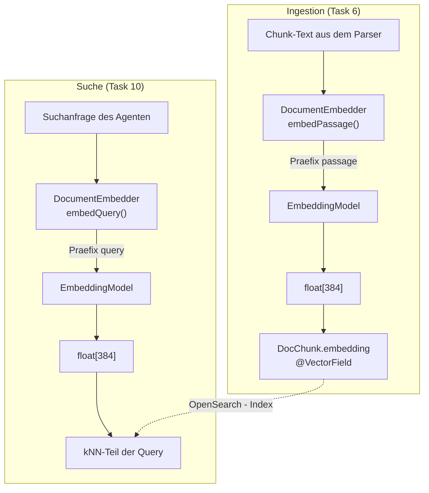
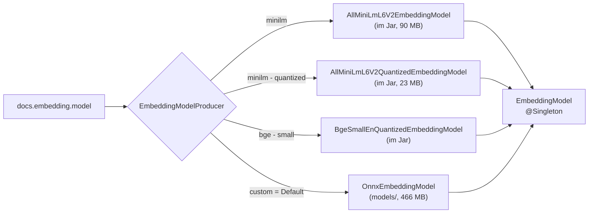
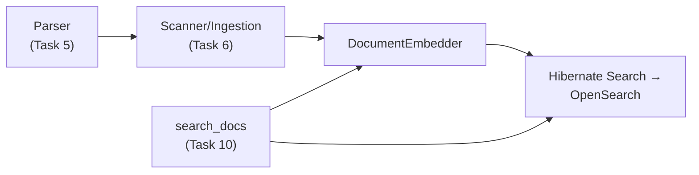

# Embedding: Ablauf und Klassenrollen

Wie aus Text ein Vektor wird, wer daran beteiligt ist und welche Stolpersteine dabei bewusst abgefangen sind. Die
verbindliche Anforderung steht in `CLAUDE.md`, Kernanforderung 6 — diese Datei beschreibt die Umsetzung!

## Warum überhaupt Embeddings

`search_docs` sucht hybrid: BM25 findet Treffer über exakte Begriffe, kNN über semantische Nähe. Für den kNN-Teil
braucht jeder indexierte Chunk einen Vektor, und jede Suchanfrage ebenfalls einen — im selben Vektorraum, sonst sind sie
nicht vergleichbar. Genau das erzeugt das Embedding-Modell.

Es läuft **in-process** über ONNX Runtime: kein externer Modell-Server, keine API-Kosten, keine Netzwerklatenz pro
Chunk.

## Die zwei Wege durch dieselbe Komponente

Entscheidend ist, dass es **zwei Aufrufkontexte** gibt, die unterschiedlich behandelt werden müssen:



Beide Wege benutzen **dasselbe** Modell — nur das Präfix unterscheidet sich. E5-Modelle sind darauf trainiert; ohne die
Präfixe fällt die Trefferqualität spürbar ab.

## Klassenrollen

| Klasse                                | Rolle                                                                                                                                                                                                          |
|---------------------------------------|----------------------------------------------------------------------------------------------------------------------------------------------------------------------------------------------------------------|
| `EmbeddingConfig`                     | Liest `docs.embedding.*` als typsicheres `@ConfigMapping`: Modellwahl, ONNX-/Tokenizer-Pfad, Dimension, Pooling-Modus, die beiden Präfixe. Enthält das Enum `ModelChoice` mit den vier gültigen Werten.        |
| `EmbeddingModelProducer`              | CDI-Producer. Übersetzt `docs.embedding.model` in eine konkrete LangChain4j-`EmbeddingModel`-Implementierung und stellt sie als `@Singleton` bereit. Prüft bei `custom`, ob die Dateien überhaupt lesbar sind. |
| `DocumentEmbedder`                    | Die Schicht, mit der alle anderen arbeiten. Kapselt das Präfix-Wissen und bietet nur kontextbezogene Methoden an. **Niemand ruft `EmbeddingModel` direkt auf.**                                                |
| `EmbeddingDimensionCheck`             | Startup-Wächter. Vergleicht Config, echte Modellausgabe und Vektorfeld des Index.                                                                                                                              |
| `DocChunk`                            | Hält das Ergebnis in `embedding` (`@VectorField`) und die Konstante `EMBEDDING_DIMENSION`, gegen die geprüft wird.                                                                                             |
| `scripts/download-embedding-model.sh` | Holt `model.onnx` und `tokenizer.json` nach `models/`. Kein Teil der Anwendung.                                                                                                                                |

### `DocumentEmbedder` im Detail

Vier öffentliche Methoden, jede mit einem klaren Aufrufkontext:

#### `float[] embedQuery(String query)`

Stellt `docs.embedding.query-prefix` (Default `"query: "`) vor den Text, schickt das Ergebnis durch das Modell und gibt
den rohen Vektor zurück.

**Aufrufer**: `search_docs` (Task 10), genau einmal pro Suchanfrage. Der zurückgegebene Vektor geht in den kNN-Teil der
Hybrid-Query.

Der Rückgabetyp ist absichtlich `float[]` und nicht LangChain4js `Embedding`: das ist genau der Typ, den
`DocChunk.embedding` und die kNN-Predicate von Hibernate Search erwarten, und er hält die LangChain4j-Typen aus dem Rest
der Anwendung heraus.

#### `float[] embedPassage(String text)`

Dasselbe mit `docs.embedding.passage-prefix` (Default `"passage: "`).

**Aufrufer**: die Ingestion (Task 6) für einzelne Chunks. Das Ergebnis wird in
`DocChunk.embedding` gesetzt, bevor der Chunk an Hibernate Search geht.

Warum überhaupt eine zweite Methode statt eines Parameters: Ein `embed(text, Kontext)` wäre eine Einladung, den Kontext
falsch zu setzen. Zwei getrennte Namen machen an der Aufrufstelle sichtbar, worum es sich handelt.

#### `List<float[]> embedPassages(List<String> texts)`

Batch-Variante: präfigiert **jeden** Text einzeln, verpackt sie als `TextSegment` und ruft
`embedAll` **einmal** auf, statt pro Chunk einmal ins Modell zu gehen.

**Aufrufer**: die Ingestion (Task 6). Eine Sources-JAR erzeugt schnell tausende Chunks — das ist der Regelweg,
`embedPassage` eher der Einzelfall.

**Zusicherung, auf die sich der Aufrufer verlässt**: Die Reihenfolge der Ergebnisliste entspricht der Eingabeliste. Nur
deshalb kann die Ingestion Vektor *n* wieder Chunk *n* zuordnen — die Zuordnung läuft über den Index, nicht über eine ID
im Vektor.

#### `int dimension()`

Reicht die Dimension des konfigurierten Modells durch. Der Wert wird von LangChain4j beim ersten Aufruf ermittelt (indem
einmal ein Dummy-Text eingebettet wird) und danach gecacht — der Aufruf ist also einmal teuer und danach billig.

> **Hinweis**: Diese Methode hat aktuell **keinen Aufrufer**. `EmbeddingDimensionCheck` prüft
> bewusst über `embedPassage("dimension probe").length`, weil es die Dimension am echten Ergebnis
> messen will und nicht an einer Auskunft des Modells über sich selbst.

### Was es bewusst *nicht* gibt

Es gibt **keine** Methode, die unpräfigierten Text einbettet. Damit kann ein Aufrufer das Präfix nicht vergessen — die
Regel ist nicht dokumentiert, sondern durch die API erzwungen.

Ebenso bewusst liegt das Präfix-Wissen **nicht** in den Parsern: die Chunking-Logik aus Task 5 soll nicht wissen müssen,
welches Embedding-Modell konfiguriert ist.

Und im Anwendungscode kennt außer `DocumentEmbedder` selbst und dem `EmbeddingModelProducer` niemand das
`EmbeddingModel` — sonst gäbe es einen Weg am Präfix vorbei. (In den Tests, die den Producer prüfen, wird es direkt
injiziert; das ist genau ihr Zweck.)

## Modellwahl



Alle vier Module liegen im Classpath — deshalb ist ein Wechsel reine Konfiguration und braucht weder Codeänderung noch
Rebuild:

```bash
java -Ddocs.embedding.model=minilm-quantized -jar target/quarkus-app/quarkus-run.jar
```

Der Default ist `custom` mit **multilingual-e5-small**. Grund für die Wahl: mehrsprachig, damit deutschsprachige
Doku-Anteile genauso sinnvoll eingebettet werden wie englische. Die drei gebündelten Alternativen sind englischsprachig.

Praktisch günstig: **alle vier Optionen liefern 384 Dimensionen**, ein Wechsel verletzt das Index-Mapping also nicht.

## Die drei Stolpersteine

### 1. Präfixe — falsch, aber ohne Symptom

Ohne `"query: "`/`"passage: "` funktioniert alles weiter, nur die Trefferqualität sinkt. Deshalb sind sie in
`DocumentEmbedder` eingebaut statt an den Aufrufer delegiert.

Für `minilm` und `bge-small` sind die Präfixe umgekehrt **Rauschen** und gehören geleert:

```properties
docs.embedding.query-prefix=
docs.embedding.passage-prefix=
```

### 2. Dimension — falsch, aber ohne Symptom

Passen konfigurierte Dimension, Modellausgabe und `@VectorField` nicht zusammen, wirft nichts eine Exception; der
kNN-Teil liefert einfach Unsinn. `EmbeddingDimensionCheck` macht daraus beim Start einen lauten Fehler, indem es einen
Probetext **wirklich einbettet** statt der Konfiguration zu glauben:

```
IllegalStateException: docs.embedding.dimension is 512 but the index vector field is 384.
Both have to match; adjust the configuration or the entity and reindex everything.
```

Das kostet ~5 s Startzeit, weil dafür das ONNX-Modell geladen wird. Bewusster Tausch: einmal langsamer starten ist
besser als dauerhaft still falsch suchen.

**Modellwechsel mit anderer Dimension erfordert einen vollständigen Reindex** aller Projekte und Versionen —
inkrementell geht das nicht, weil die alten Vektoren im Index nicht mehr zum neuen Vektorraum gehören.

### 3. Leere Config-Werte

SmallRye liest einen leeren Property-Wert als *fehlend* und scheitert dann daran, ihn in einen
`String` zu konvertieren — auch `defaultValue = ""` hilft nicht. Alles, was leer sein darf, ist deshalb
`Optional<String>` mit `orElse("")`:

- `docs.embedding.query-prefix`
- `docs.embedding.passage-prefix`
- `docs.index.prefix` (nicht Embedding, aber derselbe Fallstrick)

## Einrichtung

```bash
scripts/download-embedding-model.sh
```

Lädt `model.onnx` (449 MB) und `tokenizer.json` (17 MB) aus dem offiziellen Repository
`intfloat/multilingual-e5-small` nach `models/multilingual-e5-small/`. Der in `CLAUDE.md`
ursprünglich vorgesehene `optimum-cli export onnx`-Schritt entfällt, weil der ONNX-Export dort bereits mitgeliefert
wird. Die Dateien sind gitignored; das Skript ist idempotent.

## Wo das in den Gesamtablauf passt



Task 4 liefert ausschließlich `DocumentEmbedder` samt Konfiguration und Startup-Prüfung. Wer ihn aufruft, entsteht in
Task 6 (Ingestion) und Task 10 (Suche).
