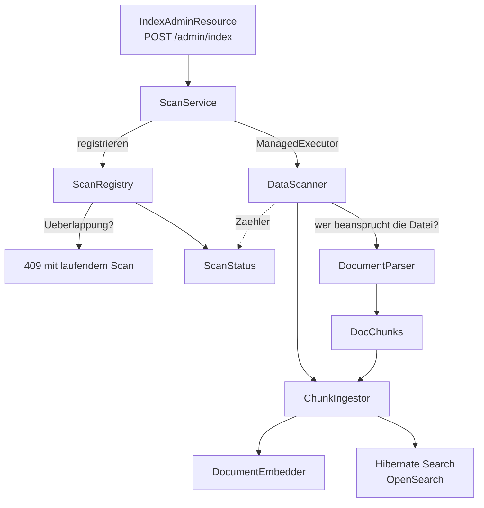

# Ingestion: vom Verzeichnis in den Index

Was die Klassen im Package `org.kvasir.scan` tun, wie sie zusammenspielen und was dabei
zwischengespeichert wird. Die verbindlichen Anforderungen stehen in `CLAUDE.md`, Kernanforderung 0
und im Abschnitt „Indexierung als REST-Endpoint" — diese Datei beschreibt die Umsetzung.

## Wortherkunft: warum „Ingestion"

*To ingest* heißt „aufnehmen, einspeisen". In Such- und Datenpipelines ist **Ingestion** der
feststehende Begriff für den Weg von der Rohquelle in den Index — das Gegenstück zu **Retrieval**,
dem Weg wieder heraus. Ein `Ingestor` ist entsprechend „das Ding, das einspeist".

Kein Java- oder Jakarta-Begriff, sondern Domänenvokabular. In diesem Projekt ist es allerdings
bereits durch die Spezifikation gesetzt: `CLAUDE.md` benutzt „Ingestion" mehrfach, unter anderem als
Überschrift „Ingestion-Regeln" und in der Architekturbeschreibung.

## Überblick



Die Abhängigkeiten zeigen alle in eine Richtung: `DataScanner` kennt `ChunkIngestor` und
`ScanStatus`, aber weder `ScanService` noch `ScanRegistry`. Deshalb lässt sich der Scanner im Test
synchron und ohne HTTP treiben, und die Überlappungsregel ohne Cluster prüfen.

## Die Klassen

| Klasse | Rolle |
|---|---|
| `DataScanner` | Kennt das Verzeichnis-Layout und sonst nichts. Läuft `<data-dir>/<project>/{doc\|<version>}/**` ab und fragt pro Datei nur, welcher Parser sie beansprucht. |
| `ChunkIngestor` | Die Schreibseite. Hash bilden, alte Chunks entfernen, embedden, schreiben. Alles, was den Index verändert, geht hier durch. |
| `KnownFileHashes` | Momentaufnahme der bereits erfassten Datei-Hashes eines Scan-Bereichs. |
| `ScanService` | Macht aus dem synchronen Scan einen Hintergrundlauf. |
| `ScanRegistry` | Hält alle Scans und entscheidet, wer starten darf. |
| `ScanStatus` | Zustand und Zähler eines Scans; veränderlich und thread-sicher. |

### `DataScanner`

Leitet die Metadaten aus dem Pfad ab: Verzeichnis der ersten Ebene ist das `project`, der zweiten
die `version` — außer es heißt `doc`, dann ist die Version `null` („gilt für alle Versionen").

Der Kern ist bewusst kurz:

```java
DocumentParser parser = parserFor(name(file));
if (parser == null) return;
status.fileScanned();

String contentHash = ChunkIngestor.hash(file);
if (known.isUnchanged(location, contentHash)) { status.fileSkipped(); return; }

List<DocChunk> chunks = parser.parse(location, file);
status.fileIndexed(ingestor.replace(..., contentHash, chunks));
```

Er kennt **keine** Dateiendungen und **keine** Parser-Typen — ein neues Format ist ein neuer
`DocumentParser` und keine Änderung hier. Den Dateiinhalt liest er ebenfalls nicht; nur den Hash,
und den streamend.

Fehler sind zweifach eingezäunt: eine kaputte Datei erhöht `failedFiles`, ein nicht durchlaufbares
Projektverzeichnis `failedProjects` — beides ohne den Scan abzubrechen. Ein kaputtes Projekt darf
die anderen nicht mitnehmen.

Das innere `record ScanScope(Path projectDir, String version)` ist der Grund, warum `project` nicht
mehr separat durchgereicht wird: es *ist* `projectDir.getFileName()`.

### `ScanService`

Dünn, aber mit einer Reihenfolge, die zählt: erst `registry.start(...)`, dann
`executor.execute(...)`. Der Scan ist damit **registriert, bevor** er beginnt — der Aufrufer bekommt
eine `scan-id`, die der Status-Endpunkt sofort kennt, auch wenn noch keine Datei angefasst wurde.
Wirft der Scan, fängt `run(...)` das ab und setzt `FAILED` samt Meldung, statt die Exception im
Worker-Thread verpuffen zu lassen.

### `ScanRegistry`

Zwei Aufgaben, die zusammengehören müssen. **Nachhalten**: `ConcurrentHashMap`, `all()` nach
Startzeit absteigend, die 50 jüngsten abgeschlossenen bleiben erhalten. **Überlappung verhindern**:

```java
static boolean overlaps(String projectA, String versionA, String projectB, String versionB) {
    if (projectA == null || projectB == null) return true;   // Vollscan deckt alles
    if (!projectA.equals(projectB))          return false;   // andere Projekte: unabhaengig
    return versionA == null || versionB == null || versionA.equals(versionB);
}
```

Zwei Versionen desselben Projekts gelten bewusst als unabhängig — sie schreiben disjunkte Chunks.

Entscheidend ist, dass `start(...)` **`synchronized`** ist: Prüfung und Registrierung müssen ein
Schritt sein, sonst kämen zwei gleichzeitig eintreffende Anfragen beide durch. Der Rückgabetyp
`Started(ScanStatus scan, boolean isNew)` transportiert bei Ablehnung den *laufenden* Scan — daraus
baut die REST-Schicht die `409`-Antwort mit Verweis.

### `ScanStatus`

Der Scan schreibt die Zähler, der HTTP-Endpunkt liest sie parallel — daher `AtomicInteger` für die
Zähler und `volatile` für Zustand, Endzeit und Fehlermeldung. Die Schreibmethoden sind
**package-sichtbar**, die Getter public: von außen ist ein `ScanStatus` nur lesbar.

Es gilt `scannedFiles == indexedFiles + skippedFiles + failedFiles`.

## `ChunkIngestor` im Detail

### `hash(Path)` — der Fingerabdruck

```java
MessageDigest digest = MessageDigest.getInstance("SHA-256");
try (InputStream in = new DigestInputStream(Files.newInputStream(file), digest)) {
    in.transferTo(OutputStream.nullOutputStream());
}
```

Die Datei wird durch den Digest **hindurchgeschoben** und die Bytes sofort verworfen. Deshalb lässt
sich ein Sources-Archiv beliebiger Größe hashen, ohne den Heap zu belasten — und es wird nur einmal
gelesen, denn den Inhalt holt sich der Parser selbst.

### `replace(...)` — die eigentliche Ingestion

```java
deletePreviousChunks(project, version, filePath);   // 1
embed(chunks);                                      // 2
// 3: Chunks schreiben, danach IndexedFile aktualisieren
```

**Schritt 1 ist der, den man weglassen würde und dann bereut.** Ein Markdown-Chunk wird über seine
Position in der Datei unterschieden — die ID selbst ist ein Hash, aber die laufende Nummer geht in
ihn ein. Schrumpft eine Datei von drei Abschnitten auf einen, überschreibt der neue Lauf nur den
Chunk zu Position 0; die zu 1 und 2 blieben als Waisen im Index und tauchten weiter in
Suchergebnissen auf, mit Inhalt, der in der Datei nicht mehr steht. Die Löschabfrage trifft deshalb
zwei Formen:

```java
.should(f.match().field("source").matching(filePath))                  // doc/overview.md
.should(f.wildcard().field("source")
        .matching(SourceLocation.archiveEntryPrefix(filePath) + "*"))  // …-sources.jar!/*
```

Die zweite Zeile sorgt dafür, dass ein geändertes Archiv **alle** seine Chunks mitnimmt, obwohl sie
unter tausenden verschiedener `source`-Werte liegen. Gelöscht wird per Scroll (500er-Seiten) und
dann einzeln per `purge(id)` — Hibernate Search Standalone kennt kein „delete by query".

**Schritt 2** embeddet in Blöcken zu 32 und lässt `SOURCE`-Chunks aus: die werden über den
Klassennamen geholt, nie über semantische Ähnlichkeit. Die Zuordnung Vektor → Chunk läuft über den
Listenindex und verlässt sich darauf, dass `embedPassages` die Reihenfolge erhält (siehe
[`docs/embedding.md`](embedding.md)).

**Schritt 3** schreibt die Chunks und **danach** `IndexedFile`. Die Reihenfolge ist Absicht: bricht
der Lauf mittendrin ab, ist der Hash nicht aktualisiert, die Datei gilt beim nächsten Scan als
geändert und wird vollständig neu gemacht. Andersherum wäre eine halb geschriebene Datei für immer
als „fertig" markiert.

### `versionMatches(...)` — `static` und package-sichtbar, nicht zufällig

`version = null` ist kein Wert im Index, sondern ein **fehlendes Feld**. Es muss als
`mustNot(exists(version))` gesucht werden, nicht als `match(null)`. Die Methode ist so geschnitten,
weil `search_docs` in Task 10 dieselbe Unterscheidung braucht.

## Was und wo zwischengespeichert wird

Es gibt genau **einen** dauerhaften Mechanismus und **einen** kurzlebigen. Sonst nichts — kein
Caffeine, kein `@CacheResult`, keine eigene Map irgendwo im Code.

### 1. Der Fingerabdruckspeicher — dauerhaft, im Suchindex

| | |
|---|---|
| **Was** | Pfad + SHA-256 des Dateiinhalts, als `IndexedFile`-Dokument |
| **Wo** | Im OpenSearch-Index `kvasir-indexed-file` — nicht im Speicher, nicht auf Platte |
| **Schlüssel** | `project/version/pfad`, bei fehlender Version `project/-/pfad` |
| **Lebensdauer** | Übersteht Neustarts; verschwindet nur mit dem Index |
| **Effekt** | Zweiter Vollscan: **65 ms statt 18 s**, 0 statt 2069 geschriebene Chunks |

Warum im Index und nicht in einer Datei oder Datenbank: eine zentrale Rohdaten-Datenbank ist ein
ausdrückliches Nicht-Ziel, und der Index ist ohnehin der einzige persistente Speicher des Systems.
Ein zweiter Speicherort wäre ein zweites Ding, das konsistent gehalten werden müsste.

Der Begriff „Cache" passt streng genommen nicht: ein Cache darf verworfen werden, ohne dass sich
Verhalten ändert. Hier ändert es sich sehr wohl — es wird nur langsamer, nicht falsch.
„Änderungsjournal" trifft es besser.

### 2. `KnownFileHashes` — kurzlebig, im Speicher, pro Scan-Bereich

Der Fingerabdruckspeicher wurde früher **pro Datei** abgefragt: eine OpenSearch-Anfrage je Datei.
Bei drei Dateien unsichtbar, bei zehntausend wäre der Scan latenzgebunden, bevor überhaupt etwas
geparst wird.

Stattdessen liest `ChunkIngestor.knownHashes(project, version)` alle Einträge eines Bereichs in
**einer** gescrollten Abfrage, und `DataScanner` hält das Ergebnis für die Dauer eines Projekts:

```java
KnownFileHashes known = ingestor.knownHashes(name(projectDir), onlyVersion);
```

| | |
|---|---|
| **Was** | `Map<fileId, contentHash>` |
| **Wo** | Im Speicher, für die Dauer **eines Projekt-Scans** |
| **Umfang** | Ein Projekt, bei eingegrenztem Scan nur die eine Version |
| **Ersparnis** | Eine Abfrage je Projekt statt einer je Datei |

Bewusst eine **Momentaufnahme**: jede Datei wird pro Scan genau einmal besucht, Einträge die während
des Laufs geschrieben werden, kann derselbe Lauf also nicht mehr brauchen. Die Granularität liegt
beim Projekt und nicht beim gesamten Baum, damit der Speicherbedarf bei vielen Projekten nicht
mitwächst.

### Was ausdrücklich **nicht** zwischengespeichert wird

- **Embeddings**: Zwei Chunks mit identischem Text werden zweimal eingebettet. Ein Text-Hash →
  Vektor-Speicher wäre denkbar, existiert aber nicht.
- **Geparste Chunks**: Ändert sich eine Datei, wird sie komplett neu geparst. Die Granularität ist
  die Datei, nicht der Chunk.
- **Die gestagete Archivkopie** (`StagedArchive`) ist kein Cache — sie wird beim Schließen gelöscht.
  Ein entferntes Archiv würde bei drei Läufen dreimal geladen, sofern es sich jedes Mal geändert
  hat; sonst greift vorher der Hash-Sprung.

## Bekannte Grenze

Ein Archiv wird als Ganzes geparst: alle Chunks liegen in einer Liste, jeder mit seinem
384-Float-Vektor. Bei `jackson-core` sind das 2069 Chunks, bei einem sehr großen Projekt eher
50.000 — inklusive der `source`-Chunks, die je eine komplette Quelldatei als String halten. Das sind
dann mehrere hundert MB Heap.

Sauber wäre, eintragsweise zu streamen und in Blöcken zu schreiben. Das bricht allerdings die
heutige Zusicherung von `replace(...)`, die alten Chunks einer Datei genau einmal und vollständig zu
ersetzen — und damit den Schutz gegen Waisen. Bewusst offen gelassen, bis ein Projekt dieser Größe
tatsächlich ansteht.
